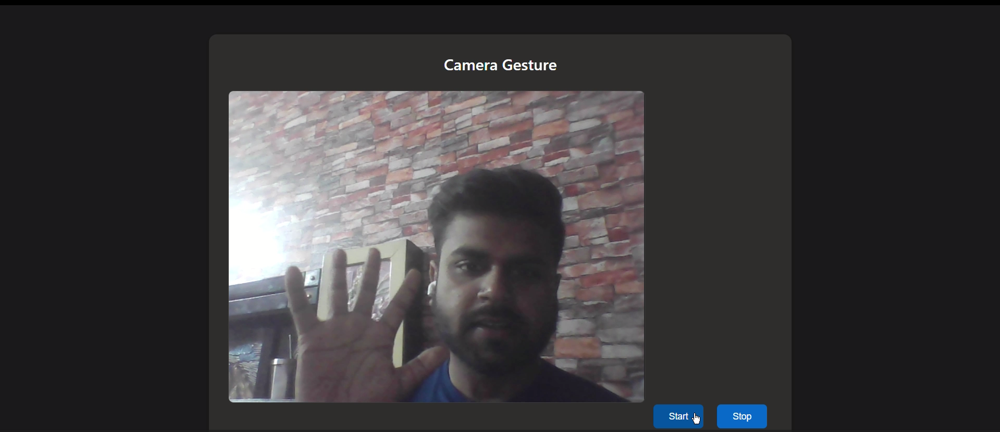

# Web Camera Gesture Detection

## 🚀 Features

- Real-time camera stream integration
- Simple gesture detection system
- Responsive design with dark mode support
- Easy-to-use start/stop controls
- Cross-browser compatibility

## 🛠️ Technologies Used

- HTML5
- CSS3
- JavaScript
- MediaDevices API
- Canvas API

## 📷 Preview

## 🔗 Live Demo
[WebMotion](https://webmotion.vercel.app)

## 🔧 Installation & Usage

1. Clone the repository:
git clone: https://github.com/vansh-frontend/Web-Cam

2. Open `index.html` in your web browser
3. Click "Start" to begin camera detection
4. Allow camera permissions when prompted
5. Click "Stop" to end the session

## 💻 Code Structure
- `index.html` - Main HTML structure
- `webcam.css` - Styling and responsive design
- `webcam.js` - Camera handling and gesture detection logic

## 🌐 Browser Support
- Chrome (recommended)
- Firefox
- Edge
- Safari

## 📝 License
This project is open source and available under the [MIT License](LICENSE).

## ⭐ Show your support
Give a ⭐️ if this project helped you!

## 👨‍💻 Author
**Vansh Dhalor**

- GitHub: [@vansh-frontend](https://github.com/vansh-frontend)
- Project Link: [Web-Cam](https://github.com/vansh-frontend/Web-Cam)

- Live Demo: [WebMotion](https://webmotion.vercel.app)

Created with ❤️ by Vansh Dhalor.

